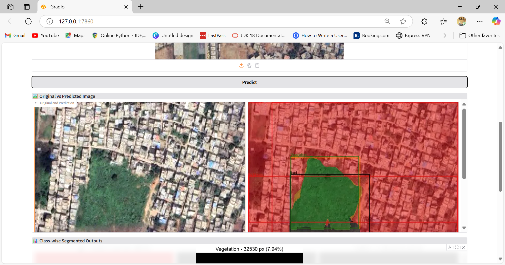
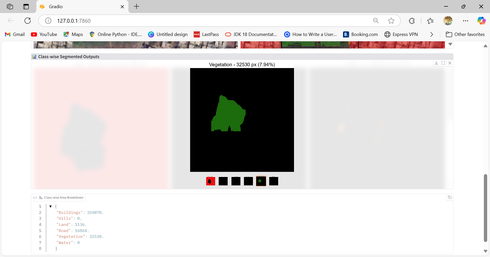
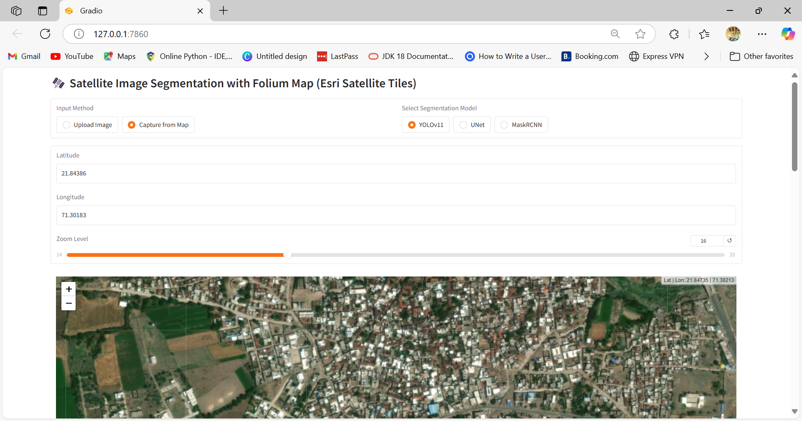

# 🌍 Satellite Image Segmentation Space

This project allows you to **upload or capture satellite images**, run segmentation predictions using **YOLOv11**, **UNet**, and **Mask R-CNN** models, and **visualize each segmented class** with corresponding area calculations.

## 🧪 Prototype Setup with GUI


<table>
  <tr>
    <td></td>
    <td></td>
    <td></td>
  </tr>
</table>

---

## 🚀 Features

- 📤 Upload custom images or 🗺️ capture from live map view
- 🧠 Predict segmentation masks using deep learning models
- 🖼️ Split output into 6 individual class-wise images:
  - Buildings 🏢
  - Hills ⛰️
  - Land 🌾
  - Road 🛣️
  - Vegetation 🌳
  - Water 🌊
- 📏 Calculate and display the pixel area covered by each class

---

## 🛠️ Installation

1. Clone the repository
```bash
git clone https://github.com/praveensunkara19/SatelliteSeg-Yolo-Unet-MaskRcnn.git
cd SatelliteSeg-Yolo-Unet-MaskRcnn

2. Set up a virtual environment (optional but recommended)

python -m venv myenv
myenv\Scripts\activate     # On Windows
#or 
source myenv/bin/activate  # On macOS/Linux

3. Install dependencies

pip install -r requirements.txt


4.▶️ How to Run
py app.py


📂 Folder Structure

SatelliteSeg-Yolo-Unet-MaskRcnn/
├── app.py                     # Main Gradio app
├── utils/                     # Helper scripts and predictors
├── models/                    # Model weights (.pt, .h5, etc.)
├── assets/                    # Visual assets (optional)
├── config.py                  # Class labels and config
├── requirements.txt           # Dependencies
├── .gitignore
├── LICENSE
└── README.md
```
📄 License
This project is licensed under the MIT License – see the LICENSE file for details.

🙌 Acknowledgments
Ultralytics YOLO
Detectron2 by Facebook Research
Gradio for the UI
Esri Satellite Maps for live map tiles


Author  @praveensunkara19 

---

